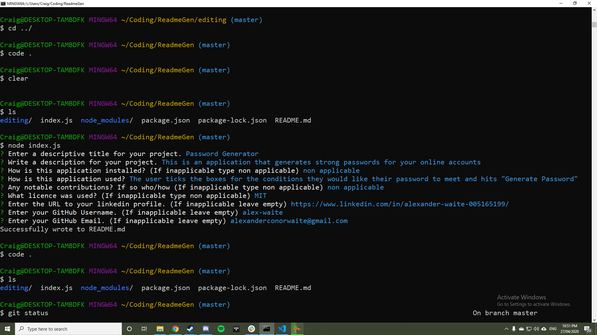

# PROJECT TITLE: Good Readme Generator!
This project was made to simplify and automate the process of creating a readme file for future projects. The software works by querying the user on things such as their contact details and description on what their project does, etc and compiles all their information into a basic README template.

# USAGE:

[Video of working program](https://drive.google.com/file/d/1nZ6zEJxq475yiO52Y1wDn4yuV_2-jFMt/view?usp=sharing)
  1. The user must first open their console and navigate to the directory the software is installed into,
  2. once in the correct directory the user must type _npm install_ into the console,
  3. The user should then place an empty file in the editing/ folder called "README.md",
  4. The user should also include a screenshot of the application they are making in the editing/ folder and name it "screeny.png" 
  5. the user should then ensure their console is in the ReadmeGen directory (where they ran _npm install_ before) and type _node index.js_ 
  a series of prompts will appear, the user should take time answering these accurately
  The user does not _HAVE TO_ answer all prompts however the software works best if all prompts are answered as intended (it is best to write "non applicable" instead of nothing).
  6. once all promps are answered the user can navigate to the editing/ folder and notice their completed README.md file (Note that for the screenshot to work the README.md file and screeny.png must be in the same folder together)

# CONTACT:
If you have any feedback or bugs to report please contact me via email at alexanderconorwaite@gmail.com.

[Find me on linkedIn!](https://www.linkedin.com/in/alexander-waite-005165199/) 

