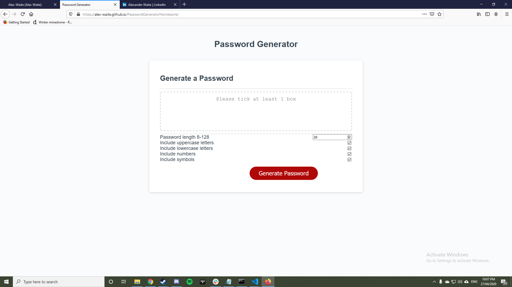

# PROJECT TITLE: Password Generator
This is an application that generates strong passwords for your online accounts

# TABLE OF CONTENTS
1. [INSTALLATION](#install)
2. [USAGE](#usage)
3. [CONTRIBUTIONS](#contributions)
4. [LICENCE](#licence)
5. [CONTACT](#contact)
  

# INSTALATION: 
non applicable
  

# USAGE:
The user ticks the boxes for the conditions they would like their password to meet and hits "Generate Password"

# CONTRIBUTIONS:
non applicable

# LICENCE: 
Licence used: MIT

# CONTACT:
If you have any feedback or bugs to report please contact me via email at alexanderconorwaite@gmail.com.
  
[Find me on linkedIn!](https://www.linkedin.com/in/alexander-waite-005165199/) 
  

  
